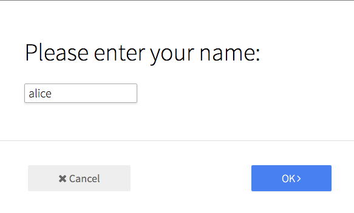

# Form: Prompt

Simple text-input prompt modal-form.



```jsx
import ModalBtn from 'patchkit-modal/btn'
import FormPrompt from 'patchkit-form-prompt'

const onSubmit = (answer, cb) => { console.log('submit', answer); cb() }
<ModalBtn
  className="center-block"
  nextLabel="OK"
  Form={FormPrompt}
  formProps={{ prompt: <h1>Please enter your name:</h1>, placeholder: 'bob', onSubmit: onSubmit }}>
  <a className="btn highlighted">Click to open</a>
</ModalBtn>
```